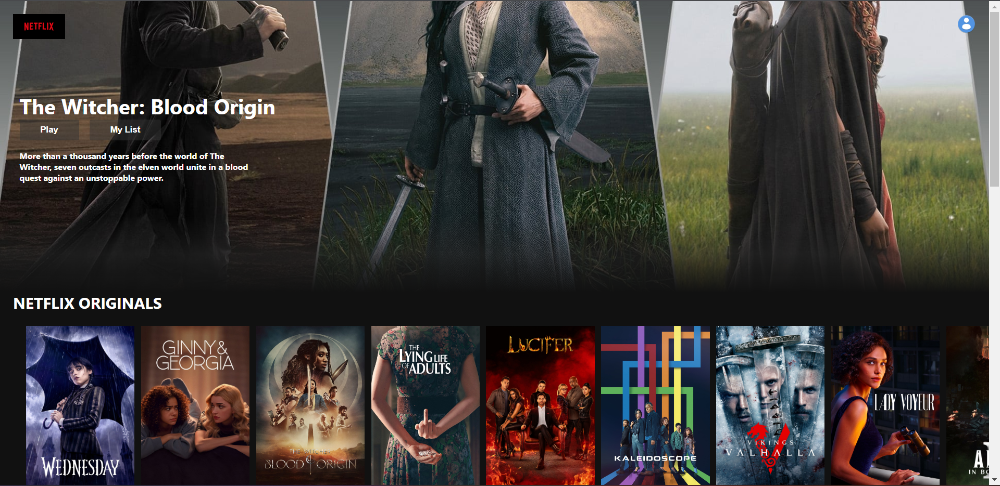
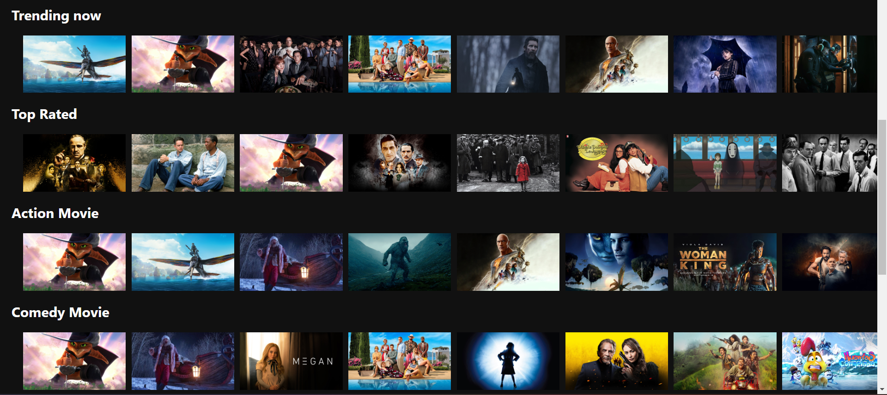

## Netflix-Clone

This is a netflix clone created using react. In this project work, I have used tmdb api to access different categories of movies list provided by tmdb providers. User will see different movie banner on the top of page and it will change on reloading the website. 
<br>

<h2> Screenshots </h2>





<h2>QuickStarted</h2>

* Open the terminal and then type
```
 $ git clone https://github.com/abhi1506manu/Netflix-Clone.
 $ cd Netflix-Clone
 ```
 * To install the required dependencies run the given command
 ```
$ npm install
```
* Create a ```.env``` file and make an account to tmdb for api then add the following
```
React_App_tmdb_api = "your tmdb api"
```
* To run app 
```
 $ npm run start
 ```
